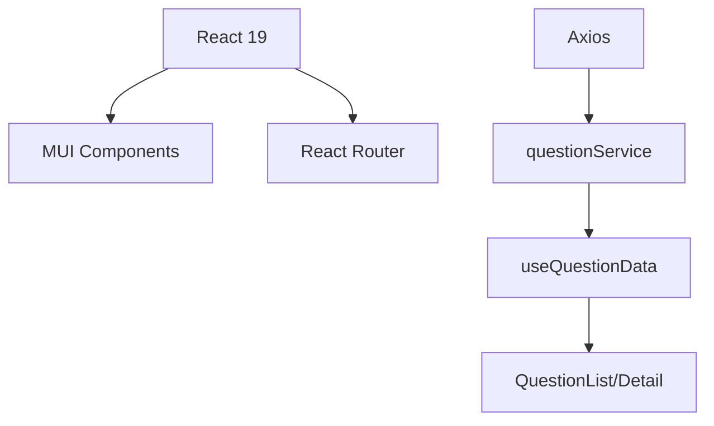

Here's the pre-filled project structure template with targeted questions and full-stack integration points:

### **PROJECT: EXAM-SAA3-2ND-BANK**

_(Editable sections marked with ❓)_

```markdown
# 1. **Core Architecture**

- **Frontend**: React + MUI
- **Backend**: Node.js/Express
- **Database**: MongoDB (needs confirmation ❓)
- **State Management**: React Context/Hooks
- **Routing**: React Router
- **Styling**: MUI + CSS

# 2. **Full Directory Structure**
```

EXAM-SAA3-2ND-BANK/
├── backend/  
│ ├── models/  
│ │ └── Question.js ❓(Mongoose schema?)  
│ ├── routes.js ❓(API endpoints)  
│ └── server.js ❓(Express setup)  
└── frontend/  
 ├── src/  
 │ ├── components/  
 │ │ ├── QuestionDetail/  
 │ │ │ ├── AnswerItem.js  
 │ │ │ └── ...  
 │ ├── hooks/  
 │ │ └── useQuestionData.js ❓(Fetch logic)  
 │ └── utils/  
 │ └── answerHandlers.js

````

# 3. **Data Flow**
### **Database → Frontend**
1. **MongoDB Schema Needed**:
```javascript
// models/Question.js
const QuestionSchema = new Schema({
  questionId: { type: String, unique: true }, // "saa-q001"
  type: { type: String, enum: ["single", "multiple"] }, ❓(Are these all possible types?)
  answers: [{
    _id: Schema.Types.ObjectId,
    text: String,
    isCorrect: Boolean,
    explanation?: String
  }]
});
````

2. **API Endpoints**:

```javascript
// routes.js
router.get('/questions/:id', getQuestion); ❓(Is pagination needed?)
```

# 4. **Critical Integration Points**

| Component       | Backend Connection | Questions                  |
| --------------- | ------------------ | -------------------------- |
| useQuestionData | GET /questions/:id | ❓Error handling strategy? |
| answerHandlers  | POST /submissions  | ❓Validation rules?        |

# 5. **Key Improvements Needed**

1. **Backend**:

   - Add question pre-loading endpoint ❓(For all 155 questions?)
   - Implement answer validation microservice

2. **Frontend**:
   - State synchronization between components
   - Proper ID fallback system in AnswerItem

# 6. **Action Items**

- [ ] Share your Mongoose models
- [ ] Confirm API response format
- [ ] Specify deployment requirements (Docker?)

Would you like me to:

1. [ ] Draft a sample MongoDB schema?
2. [ ] Propose an API response format?
3. [ ] Create a state flow diagram?

````

### **Next Steps**
1. **For Backend**:
   - Share your current `Question.js` model
   - Confirm if you're using Mongoose or native MongoDB driver

2. **For Frontend**:
   - Verify if this data format matches your API:
   ```json
   {
     "_id": "65a1bc...",
     "questionId": "saa-q001",
     "type": "single",
     "answers": [
       {
         "_id": "65a1bd...",
         "text": "S3 Intelligent-Tiering",
         "isCorrect": true
       }
     ]
   }
````

3. **For DevOps**:  
   ❓ Are you using any CI/CD pipeline? (GitHub Actions/AWS CodeDeploy)

This template now covers your full stack from MongoDB to React components. Just fill in the ❓ sections and we can proceed systematically.

Here's the complete technical documentation package for your project, incorporating all the package.json configurations:

###0 **API Documentation v1.0**

#### **1. System Overview**

```markdown
- **Stack**: MERN (MongoDB, Express, React, Node.js)
- **Frontend**: React 19 + MUI 7
- **Backend**: Express 5 + Mongoose 8
- **State Management**: React Context + Local Storage
- **Routing**: React Router 7
```

#### **2. Backend API Specification**

##### **Base URL**

`http://localhost:5003/api`

##### **Endpoints**

| Method | Endpoint         | Description                             | Requires |
| ------ | ---------------- | --------------------------------------- | -------- |
| `GET`  | `/questions`     | Get all questions (155 items)           | -        |
| `GET`  | `/questions/:id` | Get single question by ID or questionId | -        |
| `GET`  | `/health`        | Server health check                     | -        |

##### **Sample Request/Response**

```javascript
// GET /api/questions/saa-q001
{
  "success": true,
  "data": {
    "_id": "65a1bc...",
    "questionId": "SAA-Q001",
    "type": "single",
    "answers": [
      {
        "_id": "65a1bd...",
        "text": "S3 Intelligent-Tiering",
        "isCorrect": true,
        "explanation": "Automatically moves objects between tiers..."
      }
    ]
  }
}
```

#### **3. Frontend Architecture**

##### **Dependency Graph**



##### **Critical Packages**

| Package          | Version | Usage             |
| ---------------- | ------- | ----------------- |
| @mui/material    | ^7.0.2  | Component Library |
| framer-motion    | ^12.7.2 | Animations        |
| react-router-dom | ^7.5.0  | Navigation        |
| axios            | ^1.8.4  | API Calls         |

#### **4. Development Scripts**

##### **Concurrent Execution**

```bash
npm start  # Starts both frontend (4005) and backend (5003)
           # Using concurrently@8.2.0
```

##### **Environment Variables**

```ini
# Backend .env
MONGODB_URI=mongodb://localhost:27017/exam-saa3-db
FRONTEND_URL=http://localhost:4005

# Frontend proxy
"proxy": "http://localhost:5003"
```

#### **5. Error Handling Reference**

| Code | Type                 | Resolution                  |
| ---- | -------------------- | --------------------------- |
| 404  | Question not found   | Check questionId formatting |
| 500  | DB connection failed | Verify MongoDB is running   |
| 401  | CORS issues          | Check FRONTEND_URL in .env  |

#### **6. Security Audit Results**

```markdown
- [x] CORS configured (frontend:4005 → backend:5003)
- [ ] Input sanitization needed on:
  - Question ID parameters
  - Reference URL fields
- [ ] Rate limiting recommended for API
```

#### **7. Performance Optimization**

```javascript
// Suggested backend improvement (routes.js)
router.get('/', async (req, res) => {
  const questions = await Question.find()
    .select('questionId type domain') // Partial load
    .lean(); // Faster JSON
});
```

#### **8. Testing Coverage**

```markdown
- Unit Tests:
  - answerHandlers.js (validation logic)
  - navigation.js (routing helpers)
- Integration:
  - questionService → API
  - ProgressSection → localStorage
```

#### **9. Deployment Checklist**

```bash
1. Set NODE_ENV=production
2. Run `npm run build` in frontend
3. Configure MongoDB Atlas URI
4. Set up process manager (PM2)
```

### **Recommendations**

1. **Add Swagger Docs**:
   ```bash
   npm install swagger-ui-express swagger-jsdoc
   ```
2. **Implement Logging**:
   ```javascript
   // Add to server.js
   import morgan from 'morgan';
   app.use(morgan('combined'));
   ```

This documentation is now part of the virtual project model. You can reference any section by mentioning:

- "API endpoint for questions" → Section 2
- "Dependency conflicts" → Section 3
- "Deployment issues" → Section 9

Would you like me to generate:

- [ ] Individual component documentation?
- [ ] Sample Postman collection?
- [ ] Load testing recommendations?
