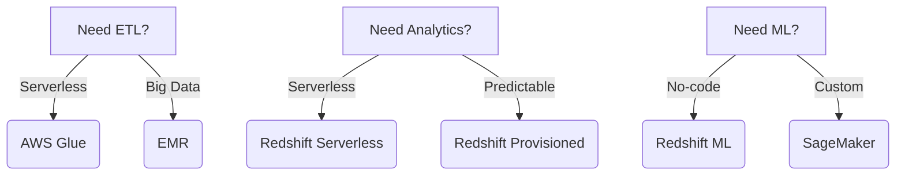

### Question 'SAA-Q000' - AWS RDS vs RDS Custom'

#### Key Differences for SAA-C03 Exam

For the AWS Certified Solutions Architect - Associate (SAA-C03) exam, it's important to understand the differences between Amazon RDS and RDS Custom. Here's a clear breakdown:

## Amazon RDS (Relational Database Service)

- **Fully managed service**: AWS handles all database administration tasks
- **Standard databases**: Supports common engines like MySQL, PostgreSQL, Oracle, SQL Server, MariaDB
- **Limited OS/database access**: No SSH or root access to underlying instances
- **Automated**: Patching, backups, scaling, failover are all automated
- **Use cases**: Traditional applications that don't need customizations

## RDS Custom

- **Managed service with customization**: AWS manages the database while you maintain OS access
- **Custom database requirements**: For specialized configurations not supported by standard RDS
- **OS and database access**: Provides SSH/RDP access to underlying EC2 instances
- **More control**: You can install custom software, change parameters, control patching schedule
- **Use cases**: Legacy applications requiring specific database/OS configurations, specialized security requirements, or custom monitoring tools

## Key Exam Considerations:

1. RDS Custom is more expensive than standard RDS
2. RDS Custom requires more management responsibility
3. Choose RDS Custom only when standard RDS can't meet your technical requirements
4. Both services provide high availability and automated backups (though with different customization options)

Remember: If a question presents a scenario needing database customization that standard RDS can't support, RDS Custom is likely the correct answer.

### Question 'SAA-Q001' -- Amazon API Gateway:

#### Use Cases & Key Functions for SAA-C03 Exam\*\*

Amazon API Gateway is a **fully managed service** that enables developers to create, publish, maintain, monitor, and secure APIs at any scale. Below are its **key use cases, functions, and exam-relevant details** for the **AWS Certified Solutions Architect - Associate (SAA-C03)** exam.

---

## **1. Primary Use Cases of API Gateway**

## **A. RESTful & HTTP APIs (Serverless Backends)**

- **Integrates with AWS Lambda** → Creates serverless APIs (common in SAA-C03 scenarios).
- **Supports AWS services (DynamoDB, S3, EC2, etc.)** → Acts as a front door for backend services.
- **Microservices architecture** → Routes requests to different services (ECS, EKS, Lambda).

## **B. WebSocket APIs (Real-Time Applications)**

- **Bidirectional communication** (e.g., chat apps, live dashboards, gaming).
- **Maintains persistent connections** → Lower latency than REST.
- **Integrates with Lambda, DynamoDB, or other backends**.

## **C. Private APIs (VPC Integration)**

- **Exposes APIs only within a VPC** (not publicly accessible).
- **Uses VPC Endpoints (Interface VPC Endpoints)** for secure access.

## **D. Edge-Optimized APIs (Global Low Latency)**

- **Uses CloudFront** to cache responses at edge locations.
- **Best for geographically distributed users**.

## **E. API Versioning & Canary Deployments**

- **Supports multiple API versions** (e.g., `/v1`, `/v2`).
- **Canary releases** → Gradually roll out new API versions to a subset of users.

---

## **2. Key Features & Functions (Exam Focus)**

| **Feature**                          | **Why It Matters for SAA-C03**                                           |
| ------------------------------------ | ------------------------------------------------------------------------ |
| **Authentication & Authorization**   | Supports **AWS IAM, Cognito, Lambda Authorizers, and JWT** for security. |
| **Throttling & Rate Limiting**       | Prevents API abuse (configurable request quotas).                        |
| **Caching**                          | Reduces backend load by caching responses (TTL configurable).            |
| **Request/Response Transformations** | Modifies data between client & backend (e.g., XML → JSON).               |
| **CORS Support**                     | Enables cross-origin requests for web apps.                              |
| **Logging & Monitoring**             | Integrates with **CloudWatch & X-Ray** for observability.                |
| **Custom Domain Names (HTTPS)**      | Uses **ACM (AWS Certificate Manager)** for SSL/TLS.                      |

---

## **3. Common API Gateway Integrations (Exam Scenarios)**

| **Integration Type**                      | **Use Case**                                   |
| ----------------------------------------- | ---------------------------------------------- |
| **Lambda Function**                       | Serverless API backend (most common in exams). |
| **HTTP Endpoint (EC2, ALB, On-Premises)** | Proxy for existing web services.               |
| **DynamoDB (Direct)**                     | CRUD operations via API calls (NoSQL).         |
| **Step Functions**                        | Orchestrates workflows via API.                |
| **SQS/SNS**                               | Asynchronous message processing.               |

---

## **4. Important SAA-C03 Exam Tips**

✅ **If a question asks for a "serverless API" → Think API Gateway + Lambda.**  
✅ **For real-time apps (chat, gaming) → WebSocket APIs.**  
✅ **For private APIs → Use API Gateway + VPC Endpoints.**  
✅ **For global low latency → Edge-optimized API Gateway.**  
✅ **Security? → IAM, Cognito, or Lambda Authorizers.**  
✅ **Need caching? → Enable API Gateway caching with CloudFront.**

---

## **Final Summary**

API Gateway is a **core service for building scalable APIs** in AWS. The SAA-C03 exam frequently tests:  
✔ **Serverless architectures (Lambda + API Gateway)**  
✔ **Security (IAM, Cognito, JWT)**  
✔ **Performance (caching, throttling, WebSockets)**  
✔ **Integrations (DynamoDB, EC2, Step Functions)**

**Remember:** API Gateway is **not just for Lambda**—it can connect to almost any backend!

### Question 'SAA-Q002' - Recognizing EKS Anywhere & Outposts

#### as Fully Local + AWS API Solutions (SAA-C03 Context)\*\*

In the **AWS SAA-C03 exam**, you may encounter scenarios where a company needs **Kubernetes (EKS) to run both on-premises (locally) and in AWS with full AWS API compatibility**. The **only two solutions** that meet this requirement are:

## **1. Amazon EKS Anywhere**

- **What it is**: A **fully supported, on-premises Kubernetes deployment** that uses the same AWS EKS APIs and tooling.
- **Key Features**:
  - Uses the **same EKS control plane APIs** as AWS cloud.
  - **Self-managed infrastructure** (you manage the underlying VMs, networking, storage).
  - **AWS provides tooling (eksctl, EKS-Distro)** for consistency.
- **Exam Use Case**:
  - "A company wants to run Kubernetes **on-premises** but use the **same AWS EKS tools and APIs** for hybrid consistency."

## **2. AWS Outposts**

- **What it is**: **AWS hardware installed in your data center**, providing **native AWS services (like EKS) locally**.
- **Key Features**:
  - **Fully managed by AWS** (unlike EKS Anywhere, where you manage the servers).
  - **Same APIs as AWS cloud** (seamless hybrid experience).
  - Supports **EKS, EC2, RDS, S3, etc.** on-premises.
- **Exam Use Case**:
  - "A company needs **low-latency access to AWS services** but must keep data **on-premises due to compliance**."

---

## **Comparison: EKS Anywhere vs. Outposts for SAA-C03**

| Feature                   | **EKS Anywhere**                    | **AWS Outposts**                               |
| ------------------------- | ----------------------------------- | ---------------------------------------------- |
| **Management**            | Self-managed infrastructure         | Fully managed by AWS                           |
| **Hardware**              | Your own servers                    | AWS-provided rack                              |
| **AWS API Compatibility** | Yes (same EKS APIs)                 | Yes (full AWS services)                        |
| **Use Case**              | Kubernetes on-prem with AWS tooling | Full AWS services on-prem (EKS, RDS, S3, etc.) |
| **Cost**                  | Lower (no Outposts fee)             | Higher (pay for Outposts hardware)             |

---

## **Exam Scenarios & Correct Answers**

## **Scenario 1:**

_A company wants to run Kubernetes **on-premises** but maintain **full compatibility with AWS EKS APIs** without managing AWS hardware._  
✅ **Correct Answer**: **EKS Anywhere** (self-managed, same APIs).  
❌ Wrong: Outposts (requires AWS hardware).

## **Scenario 2:**

_A financial firm needs **EKS, RDS, and S3 locally** for compliance, with **full AWS API support**._  
✅ **Correct Answer**: **AWS Outposts** (supports multiple AWS services locally).  
❌ Wrong: EKS Anywhere (only does Kubernetes).

## **Scenario 3:**

_A hybrid cloud setup requires **low-latency access to AWS EKS APIs** but must run workloads **on-premises**._  
✅ **Correct Answer**: **Either EKS Anywhere or Outposts** (both work, but Outposts is fully managed).

---

## **Key SAA-C03 Takeaways**

- **EKS Anywhere** = **Self-managed Kubernetes** on your hardware, but with AWS EKS APIs.
- **AWS Outposts** = **AWS-managed hardware** in your DC, running full AWS services (including EKS).
- **Both provide AWS API consistency** for hybrid/on-prem Kubernetes.
- **If the question mentions "full AWS services" (not just EKS) → Outposts.**
- **If it's just Kubernetes with AWS tooling → EKS Anywhere.**

This distinction is **critical for hybrid cloud questions** on the SAA-C03 exam! 🚀

### Question 'SAA-Q003' -- AWS Services Count

#### (2025) & SAA-C03 Exam Reality Check\*\*

As of 2025, **AWS offers over 200+ services**, but **you don’t need to memorize all of them for the SAA-C03 exam**. Here’s the breakdown:

---

## **1. How Many AWS Services Exist?**

- **AWS launched ~20–30 new services per year** (e.g., 2019: 165 services → 2023: 200+).
- **As of 2025, the total is likely ~220–250 services**, but **only ~30–40 are relevant for SAA-C03**.

---

## **2. SAA-C03 Exam Focus: Core Services (Not Every Niche Tool)**

The exam tests **foundational AWS services**—not obscure ones like DataBrew or AppFlow unless explicitly mentioned in the **AWS Exam Guide**.

## **Key Services You MUST Know**

| **Category**         | **Core Services**                                                   |
| -------------------- | ------------------------------------------------------------------- |
| **Compute**          | EC2, Lambda, ECS, EKS, Fargate, Batch                               |
| **Storage**          | S3, EBS, EFS, FSx, Storage Gateway                                  |
| **Databases**        | RDS, DynamoDB, Aurora, Redshift, ElastiCache                        |
| **Networking**       | VPC, Route 53, CloudFront, ALB/NLB, Direct Connect, Transit Gateway |
| **Security**         | IAM, KMS, Secrets Manager, Cognito, GuardDuty, Shield               |
| **Management**       | CloudWatch, CloudTrail, Config, Systems Manager, Trusted Advisor    |
| **Serverless**       | API Gateway, Step Functions, EventBridge, SQS, SNS                  |
| **Migration**        | DMS, Snowball, DataSync, Migration Hub                              |
| **Analytics**        | Athena, Glue (basic), Kinesis, QuickSight                           |
| **Machine Learning** | Rekognition, Comprehend, SageMaker (high-level only)                |

## **Niche Services (Rarely Tested, But Possible)**

- **Glue DataBrew** (no-code ETL for analysts)
- **AppFlow** (SaaS-to-AWS data transfers)
- **Nimble Studio** (video rendering)
- **Panorama** (IoT computer vision)
- **RoboMaker** (robotics)

**These almost never appear unless the question explicitly describes their use case.**

---

## **3. Why Did Glue DataBrew Appear in Your Question?**

AWS sometimes includes **"distractor" services** to test:

1. **Your ability to eliminate wrong options** (e.g., AppFlow is for SaaS, not data lakes).
2. **Whether you focus on key requirements** (e.g., "code-free" → DataBrew).

**You don’t need to memorize DataBrew—just know:**

- It’s a **no-code data prep tool** (for analysts).
- **Glue Studio** is for engineers (low-code).
- **AppFlow** is for SaaS integrations (Salesforce, Slack).

---

## **4. How to Prepare Without Memorizing 200+ Services?**

1. **Follow the AWS SAA-C03 Exam Guide** ([Official Link](https://aws.amazon.com/certification/certified-solutions-architect-associate/)).
2. **Focus on FAQs of core services** (e.g., S3 storage classes, RDS vs. Aurora, Lambda limits).
3. **Ignore obscure services** unless they fit a clear pattern (e.g., "no-code ETL" → DataBrew).
4. **Practice exams** (Tutorials Dojo, Whizlabs) expose you to realistic questions.

---

## **5. Final Advice**

- **Don’t panic** if you see unfamiliar services—use process of elimination.
- **80% of exam questions** cover **20% of services** (EC2, S3, Lambda, IAM, VPC, RDS, etc.).
- **Niche services** are usually **hinted at in the question** (e.g., "no-code" → DataBrew).

AWS wants you to **understand patterns**, not memorize every service. Focus on **core concepts**, and you’ll pass! 🚀

### Question 'SAA-Q0026' --- Caching Strategies for DynamoDB, S3

### and When to Avoid ElastiCache (SAA-C03 Exam Focus)\*\*

Caching is a **key performance optimization concept** in AWS, and the **SAA-C03 exam tests your ability to choose the right caching solution** for different scenarios. Below is a breakdown of **DynamoDB caching, S3 static content caching, and when ElastiCache is (or isn’t) the right choice**.

---

## **1. Caching for DynamoDB**

## **Use Case:**

- **Read-heavy workloads** where the same data is frequently accessed.
- **Reduce DynamoDB RCU (Read Capacity Unit) costs** by serving cached results.

## **AWS Solutions:**

| **Option**                        | **How It Works**                                                                           | **Exam Scenario**                                                                                                                 |
| --------------------------------- | ------------------------------------------------------------------------------------------ | --------------------------------------------------------------------------------------------------------------------------------- |
| **DynamoDB Accelerator (DAX)**    | Fully managed, in-memory cache **tightly integrated with DynamoDB** (microsecond latency). | - "Need **low-latency reads** for gaming/real-time apps."<br>- "Must reduce DynamoDB read costs **without application changes**." |
| **ElastiCache (Redis/Memcached)** | External cache (requires app logic to check cache before DynamoDB).                        | - "Need **flexible caching** (multi-table, complex queries)."<br>- "Already using Redis/Memcached."                               |

## **Key Exam Tips:**

✅ **DAX is best for:**

- **Seamless integration** (no app changes).
- **Single-table caching** (not for joins).
- **Microsecond latency** (ElastiCache is millisecond).

❌ **Avoid DAX if:**

- **Write-heavy workloads** (DAX caches reads only).
- **Multi-table queries** (use ElastiCache instead).

---

## **2. Caching for S3 Static Content**

## **Use Case:**

- **Frequently accessed static files** (images, JS, CSS, HTML).
- **Global low-latency delivery** for users worldwide.

## **AWS Solutions:**

| **Option**                   | **How It Works**                                               | **Exam Scenario**                                                                           |
| ---------------------------- | -------------------------------------------------------------- | ------------------------------------------------------------------------------------------- |
| **CloudFront (CDN)**         | Caches S3 content at **edge locations** (reduces origin load). | - "Need **fast global delivery** for static websites."<br>- "Must reduce S3 request costs." |
| **S3 Transfer Acceleration** | Speeds up **uploads** (not caching).                           | - "Users upload large files globally." (Not for caching!)                                   |

## **Key Exam Tips:**

✅ **CloudFront is the default choice for S3 caching.**

- Configure **TTL (Time-To-Live)** for cache duration.
- Use **Origin Access Identity (OAI)** for secure S3 access.

❌ **Avoid ElastiCache for S3 caching** (it’s for databases, not static files).

---

## **3. When to Avoid ElastiCache**

## **ElastiCache is NOT the best choice when:**

| **Scenario**                               | **Better Alternative**  | **Reason**                                                                |
| ------------------------------------------ | ----------------------- | ------------------------------------------------------------------------- |
| **Caching static files (JS, CSS, images)** | CloudFront              | ElastiCache is for **database query results**, not static content.        |
| **Simple, single-table DynamoDB caching**  | DAX                     | DAX is **simpler & faster** for DynamoDB.                                 |
| **Serverless apps (Lambda + API Gateway)** | API Gateway caching     | ElastiCache requires **VPC & persistent connections** (hard with Lambda). |
| **Write-heavy workloads**                  | DynamoDB on-demand mode | ElastiCache caches reads; writes still hit the DB.                        |

## **When IS ElastiCache a Good Fit?**

✔ **Multi-database caching** (e.g., MySQL + DynamoDB).  
✔ **Session storage** (scales better than DynamoDB for ephemeral data).  
✔ **Real-time leaderboards** (Redis sorted sets).

---

## **4. Summary: Caching Decision Flow for SAA-C03**

## **DynamoDB Caching:**

- **Low-latency, simple? → DAX.**
- **Complex queries, multi-table? → ElastiCache (Redis).**

## **S3 Static Content Caching:**

- **Always CloudFront (CDN).**

## **Avoid ElastiCache When:**

- Static files are involved.
- Serverless (Lambda) needs simple caching (use API Gateway caching instead).
- DAX already fits (DynamoDB-only caching).

---

## **Exam Tricks to Remember**

🔹 **"Microsecond latency for DynamoDB?" → DAX.**  
🔹 **"Global static content?" → CloudFront.**  
🔹 **"Need to cache SQL queries?" → ElastiCache.**  
🔹 **"Serverless caching?" → API Gateway caching (not ElastiCache).**

This pattern-based approach will help you **quickly eliminate wrong options** on the exam! 🚀

### **Memcached in AWS (ElastiCache Memcached) - SAA-C03 Exam Context**

Memcached is a **simple, high-performance, distributed memory caching system** used to speed up dynamic database-driven websites by caching data and objects in RAM. In AWS, it's offered as part of **Amazon ElastiCache for Memcached**.

---

## **1. Key Characteristics of Memcached (vs. Redis)**

| Feature            | **Memcached**                            | **Redis**                                 |
| ------------------ | ---------------------------------------- | ----------------------------------------- |
| **Data Types**     | Only strings                             | Strings, hashes, lists, sets, sorted sets |
| **Persistence**    | No (in-memory only)                      | Yes (snapshots, AOF)                      |
| **Multi-threaded** | Yes (better for simple, high-throughput) | No (single-threaded)                      |
| **Use Cases**      | Simple caching (no advanced features)    | Caching + queues, pub/sub, geospatial     |
| **Auto-failover**  | No                                       | Yes (with Redis Cluster)                  |

---

## **2. When to Use Memcached in AWS (SAA-C03 Scenarios)**

### ✅ **Best For:**

1. **Simple, high-throughput caching**

   - Example: Session storage, HTML fragment caching.
   - _Exam hint_: "Need a lightweight cache for temporary data with minimal overhead."

2. **Scaling read-heavy applications**

   - Example: Reducing database load for frequently accessed data (e.g., product catalogs).
   - _Exam hint_: "Application requires **low-latency reads** but does not need persistence."

3. **Multi-threaded performance**
   - Memcached supports **multi-threading**, making it better than Redis for **extremely high-throughput** caching.
   - _Exam hint_: "Need **maximum cache throughput** for simple key-value lookups."

## ❌ **Avoid Memcached When:**

1. **You need persistence or backups** → Use **Redis**.
2. **You require complex data structures (e.g., leaderboards, queues)** → Use **Redis**.
3. **You need high availability (HA) with automatic failover** → Use **Redis with Cluster Mode**.

---

## **3. Memcached vs. DAX (DynamoDB Accelerator)**

| Scenario                 | **Memcached**                                  | **DAX**                        |
| ------------------------ | ---------------------------------------------- | ------------------------------ |
| **Works with DynamoDB?** | Yes (but requires manual app logic)            | Yes (fully integrated)         |
| **Latency**              | Milliseconds                                   | Microseconds                   |
| **Setup Complexity**     | Manual (app must check cache first)            | Automatic (transparent to app) |
| **Best For**             | Multi-service caching (e.g., MySQL + DynamoDB) | DynamoDB-only caching          |

**Exam Tip:**

- If the question mentions **DynamoDB caching with lowest latency**, **DAX is the answer**.
- If it’s about **general-purpose caching** (e.g., session storage), **Memcached or Redis may fit**.

---

## **4. Memcached vs. CloudFront (S3 Caching)**

- **Memcached** → Caches **database queries or application data**.
- **CloudFront** → Caches **static files (S3 objects, APIs, websites)**.

**Exam Trap:**

- A question might try to trick you into using **Memcached for static content caching** (wrong! Use **CloudFront**).

---

## **5. Summary: When to Choose Memcached in SAA-C03**

✔ **Use Memcached when:**

- You need **simple, high-throughput key-value caching**.
- Data is **temporary** (no need for backups).
- The workload is **read-heavy with no advanced features needed**.

✖ **Avoid Memcached when:**

- You need **persistence, replication, or failover** (use Redis).
- You’re caching **static files** (use CloudFront).
- You’re only using **DynamoDB** (DAX is better).

---

## **Final Exam Tips**

🔹 **"Simple, high-speed caching?" → Memcached.**  
🔹 **"Need failover or complex data?" → Redis.**  
🔹 **"DynamoDB microsecond caching?" → DAX.**  
🔹 **"Static content caching?" → CloudFront.**

Memcached is niche but occasionally tested—know when it’s the **simplest, fastest option** for basic caching! 🚀

### Question 'SAA-Q0032'

#### **Private Connectivity Between VPCs & AWS PrivateLink (SAA-C03 Exam Focus)**

AWS offers multiple solutions for **private, secure communication between VPCs and services**. The **SAA-C03 exam tests your ability to choose the right method** based on:

- **Security requirements** (avoid public internet)
- **Scalability** (number of VPCs/services involved)
- **Cost and complexity**

---

## **1. Private Connectivity Between VPCs**

## **Options:**

| **Solution**                            | **Use Case**                                            | **Key Features**                                                                                    | **Exam Tips**                                                                                                 |
| --------------------------------------- | ------------------------------------------------------- | --------------------------------------------------------------------------------------------------- | ------------------------------------------------------------------------------------------------------------- |
| **VPC Peering**                         | Direct private connection **between 2 VPCs**.           | - No transitive routing (A→B & B→C ≠ A→C).<br>- Must **manually update route tables**.              | ✅ "Need **simple, direct VPC-to-VPC** connectivity."<br>❌ Avoid if **many VPCs** (becomes messy).           |
| **AWS Transit Gateway**                 | Hub-and-spoke model for **many VPCs/on-prem networks**. | - Supports **transitive routing** (A→B→C = A→C).<br>- Works with **VPN, Direct Connect, and VPCs**. | ✅ "Need **scalable multi-VPC/on-prem connectivity**."<br>❌ Overkill for **just 2 VPCs**.                    |
| **PrivateLink (VPC Endpoint Services)** | Expose a **service privately** (no VPC peering needed). | - Avoids public internet & NAT.<br>- **Service consumer pays** for PrivateLink.                     | ✅ "Need **secure access to a 3rd-party or internal service**."<br>❌ Not for **general VPC-to-VPC traffic**. |

---

## **2. When to Use AWS PrivateLink**

## **What is PrivateLink?**

- Allows **private connectivity to services** (AWS or custom) **without VPC peering, NAT, or internet gateways**.
- Uses **VPC Endpoints (Interface Type)** → ENIs with private IPs in your subnet.

## **Key Use Cases:**

✔ **Securely access AWS services** (e.g., S3, DynamoDB) via **Gateway Endpoints**.  
✔ **Share your own service** (e.g., internal API) with other VPCs via **Endpoint Services**.  
✔ **Access SaaS/3rd-party services** (e.g., Datadog, Splunk) privately.

## **Exam Scenarios:**

| **Scenario**                                                                                  | **Correct Solution**               |
| --------------------------------------------------------------------------------------------- | ---------------------------------- |
| "A company wants to **securely expose an internal API** to partner VPCs **without peering**." | **PrivateLink (Endpoint Service)** |
| "Need **private S3 access** without internet/NAT."                                            | **S3 Gateway Endpoint** (free)     |
| "A SaaS provider wants customers to access their service **without public internet**."        | **PrivateLink**                    |

## **PrivateLink vs. VPC Peering**

| Feature                | **PrivateLink**                          | **VPC Peering**              |
| ---------------------- | ---------------------------------------- | ---------------------------- |
| **Connection Type**    | Service-based (1-to-many)                | VPC-to-VPC (1-to-1)          |
| **Transitive Routing** | Not needed (service is directly exposed) | Not supported                |
| **Security**           | No public IPs, no route tables needed    | Requires route table updates |
| **Scalability**        | Best for **many consumers** (e.g., SaaS) | Best for **few VPCs**        |

---

## **3. When to Avoid PrivateLink**

❌ **General VPC-to-VPC traffic** → Use **VPC Peering or Transit Gateway**.  
❌ **Need low-cost S3/DynamoDB access** → Use **Gateway Endpoints** (free).  
❌ **On-premises connectivity** → Use **Direct Connect/VPN + Transit Gateway**.

---

## **4. Summary: Decision Flow for SAA-C03**

1. **"Private access to AWS services (S3, DynamoDB)?"**
   - ✅ **Gateway VPC Endpoint** (free, no PrivateLink needed).
2. **"Expose a custom service to other VPCs privately?"**
   - ✅ **PrivateLink (Interface Endpoint)**.
3. **"Connect multiple VPCs/on-prem networks?"**
   - ✅ **Transit Gateway**.
4. **"Simple connection between 2 VPCs?"**
   - ✅ **VPC Peering**.

---

## **Exam Tricks to Remember**

🔹 **"Need to avoid the public internet?" → PrivateLink or VPC Endpoints.**  
🔹 **"Many VPCs need to talk?" → Transit Gateway.**  
🔹 **"Two VPCs only?" → VPC Peering.**  
🔹 **"S3/DynamoDB private access?" → Gateway Endpoint (free).**

This pattern-based approach ensures you **pick the right AWS networking solution** on the exam! 🚀

### Question 'SAA-Q033' --- Cross-Account EFS Access & Cost-Effective Lambda

#### + EFS Integration (SAA-C03 Exam Context)\*\*

AWS **Elastic File System (EFS)** is a scalable, shared file storage service. The **SAA-C03 exam tests your ability to configure secure cross-account access and cost-effective Lambda + EFS setups**. Below are key concepts and best practices.

---

## **1. Cross-Account EFS Access**

## **How It Works**

To allow **another AWS account** to access your EFS file system:

1. **EFS Resource Policy** (JSON policy attached to EFS)
   - Defines which **external accounts** or **IAM principals** can access the EFS.
   - Example:
     ```json
     {
       "Version": "2012-10-17",
       "Id": "CrossAccountEFSAccess",
       "Statement": [
         {
           "Effect": "Allow",
           "Principal": {
             "AWS": "arn:aws:iam::123456789012:root"  # Target AWS account
           },
           "Action": [
             "elasticfilesystem:ClientMount",
             "elasticfilesystem:ClientWrite"
           ],
           "Resource": "arn:aws:elasticfilesystem:us-east-1:111122223333:file-system/fs-12345678"
         }
       ]
     }
     ```
2. **VPC Peering or Transit Gateway** (if EFS is in a private subnet)
   - Ensures **network connectivity** between accounts.
3. **Security Groups & NFS Rules**
   - Must allow **NFS traffic (port 2049)** from the requester’s VPC.

## **Exam Scenarios**

✅ **"A company wants to share an EFS file system with a partner AWS account."**  
→ **EFS Resource Policy + VPC Peering/Transit Gateway.**

❌ **"EFS is publicly accessible."**  
→ **False! EFS is private by default (must be in a VPC).**

---

## **2. Cost-Effective Lambda + EFS Integration**

## **Why Use EFS with Lambda?**

- **Persistent storage** (Lambda has ephemeral `/tmp` storage only).
- **Shared file access** (multiple Lambdas can read/write the same files).

## **Key Setup Steps**

1. **Mount EFS to Lambda**
   - Configure **Lambda VPC settings** (must be in the same VPC as EFS).
   - Attach an **EFS Access Point** (simplifies permissions).
2. **Optimize Costs**
   - **Use General Purpose (Bursting) mode** (cheaper for Lambda workloads).
   - **Avoid Provisioned Throughput** (unless high sustained I/O is needed).
   - **Monitor with CloudWatch** (watch for burst credit exhaustion).

## **Exam Scenarios**

✅ **"Need persistent shared storage for Lambda functions?"**  
→ **EFS + Lambda VPC integration.**

✅ **"How to reduce EFS costs for intermittent Lambda workloads?"**  
→ **General Purpose mode (Bursting) + monitor burst credits.**

❌ **"Lambda can access EFS without VPC configuration."**  
→ **False! Lambda must be VPC-enabled to mount EFS.**

---

## **3. Key AWS Terminology (SAA-C03 Focus)**

| **Term**                      | **Definition**                                           | **Exam Relevance**                     |
| ----------------------------- | -------------------------------------------------------- | -------------------------------------- |
| **EFS Access Point**          | A custom entry point into EFS with specific permissions. | Simplifies Lambda/EC2 access control.  |
| **Lambda VPC Config**         | Allows Lambda to access VPC resources (EFS, RDS, etc.).  | Required for EFS mounting.             |
| **NFS (Network File System)** | Protocol used by EFS (port 2049).                        | Must be allowed in Security Groups.    |
| **Bursting Throughput**       | EFS scales performance based on stored data.             | Cost-efficient for variable workloads. |

---

## **4. Summary: Key Exam Takeaways**

✔ **Cross-account EFS access** = **EFS Resource Policy + VPC Peering/TGW**.  
✔ **Lambda + EFS** = **VPC-enabled Lambda + EFS Access Point**.  
✔ **Cost optimization** = **General Purpose (Bursting) mode** for Lambda workloads.  
✔ **Security** = **EFS is private by default (no public access)**.

## **Exam Tricks**

🔹 **"Share EFS across accounts?" → Resource Policy + VPC networking.**  
🔹 **"Lambda needs persistent storage?" → EFS + VPC config.**  
🔹 **"EFS is public?" → False! Must be in a VPC.**

This ensures you **select the right EFS setup** on the SAA-C03 exam! 🚀

### Question 'SAA-Q034'--- Serverless Data Transformation

#### & Analytics (SAA-C03 Exam Focus)\*\*

AWS offers multiple solutions for **data processing, analytics, and machine learning (ML)**. The **SAA-C03 exam tests your ability to choose the most cost-effective, automated, and serverless options**. Below are key patterns to recognize.

---

## **1. Serverless Data Transformation: AWS Glue vs. EMR**

## **When to Choose AWS Glue (Over EMR)?**

| **Scenario**        | **AWS Glue (Serverless)**                                | **Amazon EMR (Managed Hadoop)**                                 |
| ------------------- | -------------------------------------------------------- | --------------------------------------------------------------- |
| **ETL Workloads**   | ✅ Fully managed, no clusters to manage                  | ❌ Requires cluster provisioning                                |
| **Cost Efficiency** | ✅ Pay per job (no idle costs)                           | ❌ Pay for running EC2 instances                                |
| **Automation**      | ✅ Auto-scaling, built-in job scheduling                 | ❌ Manual cluster tuning                                        |
| **Use Case**        | "Need **automated, scheduled ETL** for data lakes (S3)." | "Need **big data processing (Spark, Hive)** with full control." |

**Exam Tip:**

- If the question mentions **"serverless ETL"** or **"minimize infrastructure management"**, **Glue is the answer**.
- If **"Spark, Hive, or petabyte-scale processing"** is required, **EMR is better**.

---

## **2. MPP Analytics: Redshift vs. Redshift Serverless**

## **What is MPP (Massively Parallel Processing)?**

- Breaks queries into smaller tasks processed **in parallel** (fast analytics).
- Used by **Redshift (provisioned) and Redshift Serverless**.

## **When to Choose Redshift Serverless?**

| **Scenario**             | **Redshift Serverless**                                       | **Redshift Provisioned**                           |
| ------------------------ | ------------------------------------------------------------- | -------------------------------------------------- |
| **Workload Variability** | ✅ Auto-scales (no capacity planning)                         | ❌ Manual cluster resizing                         |
| **Cost Efficiency**      | ✅ Pay per query (idle=no cost)                               | ❌ Pay for provisioned nodes                       |
| **Use Case**             | "Need **on-demand SQL analytics** without managing clusters." | "Need **predictable, high-throughput** workloads." |

**Exam Tip:**

- If the question asks for **"MPP without managing nodes"**, **Redshift Serverless is correct**.

---

## **3. SQL-Based ML Modeling: Redshift ML**

## **What is Redshift ML?**

- Lets you **train and deploy ML models using SQL** (no Python/SageMaker code).
- Uses **SageMaker Autopilot** behind the scenes.

## **Key Features**

✔ **No-code ML** (CREATE MODEL with SQL).  
✔ **Works with Redshift data** (no ETL needed).  
✔ **Use Cases:** Fraud detection, customer segmentation.

**Exam Scenario:**

- "Data analysts need to **predict sales trends using SQL** without ML expertise."  
  → **Answer: Redshift ML**

---

## **4. Avoiding Infrastructure Management (Serverless Priority)**

## **Serverless vs. Managed Services**

| **Requirement**         | **Serverless Choice**  | **Managed Alternative** |
| ----------------------- | ---------------------- | ----------------------- |
| **ETL**                 | AWS Glue               | EMR (more control)      |
| **Data Warehousing**    | Redshift Serverless    | Redshift Provisioned    |
| **ML**                  | Redshift ML            | SageMaker (custom code) |
| **Real-Time Analytics** | Kinesis Data Analytics | EMR (Spark Streaming)   |

**Exam Strategy:**

- If the question emphasizes:
  - **"No infrastructure management"** → **Serverless (Glue, Lambda, Redshift Serverless)**.
  - **"High customization"** → **EMR, SageMaker, EC2**.

---

## **5. Summary: Key SAA-C03 Exam Patterns**

1. **"Automated ETL?"** → **AWS Glue** (not EMR).
2. **"MPP without clusters?"** → **Redshift Serverless**.
3. **"ML in SQL?"** → **Redshift ML**.
4. **"Minimize ops overhead?"** → **Always choose serverless first**.

## **Quick Decision Flow**



**Remember:** AWS prefers **serverless solutions** in exam scenarios unless requirements demand otherwise! 🚀
